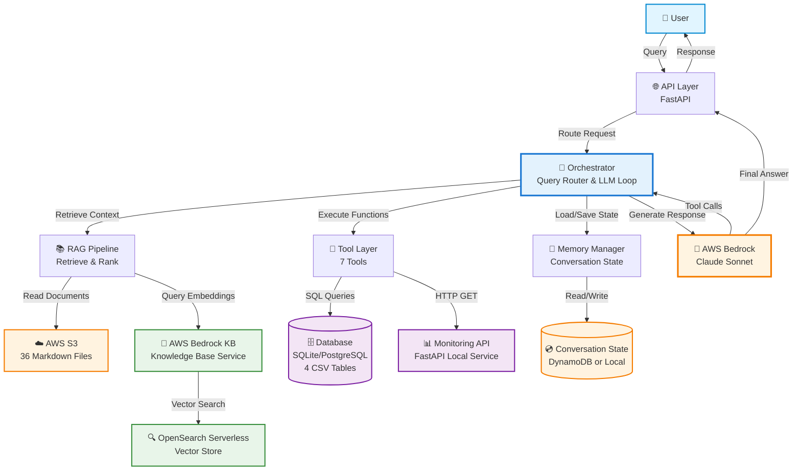
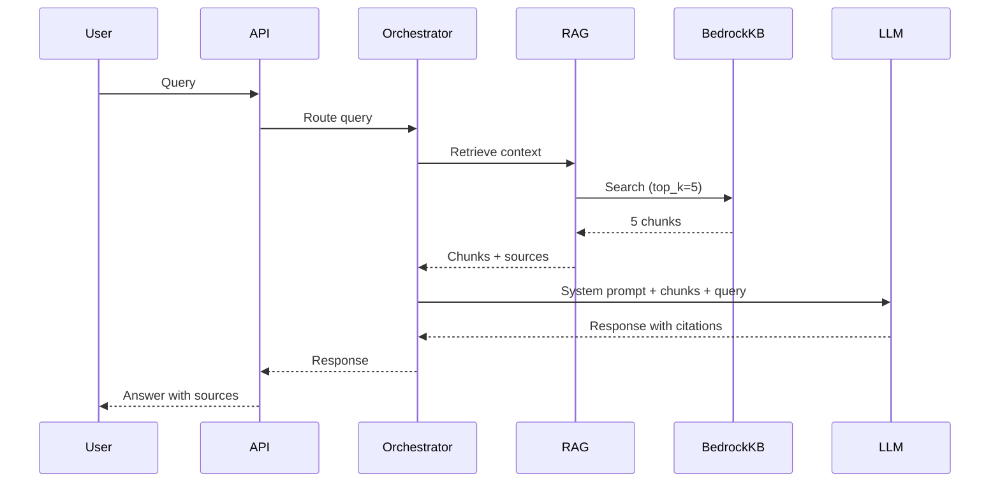
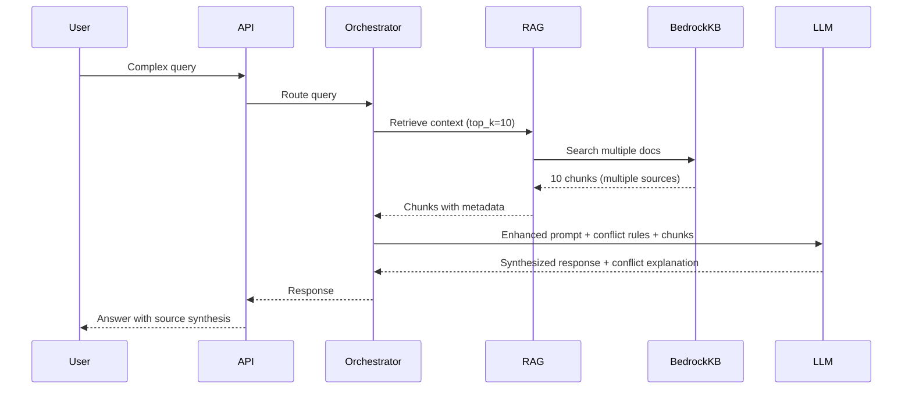
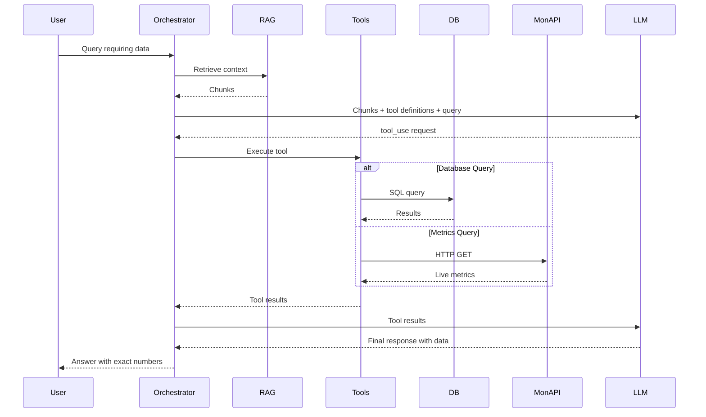
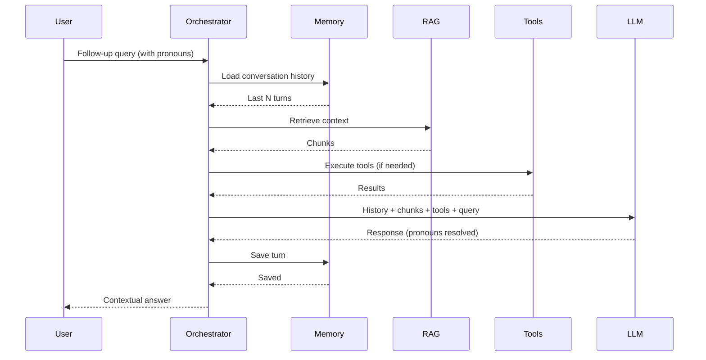
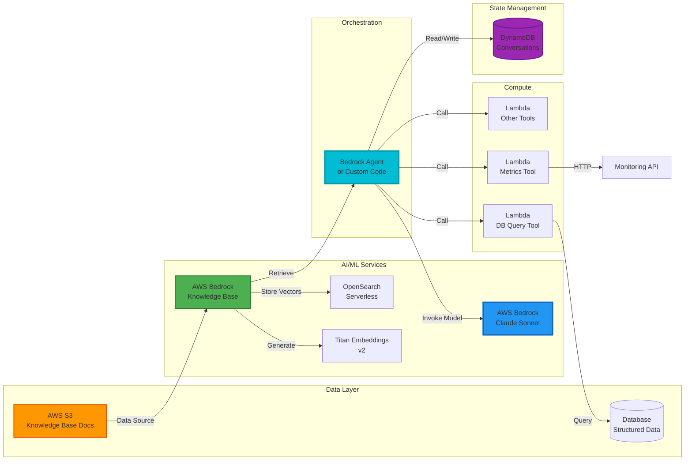
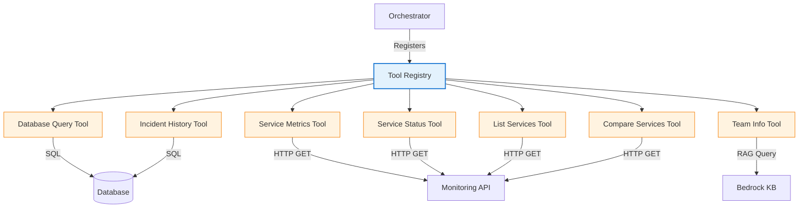
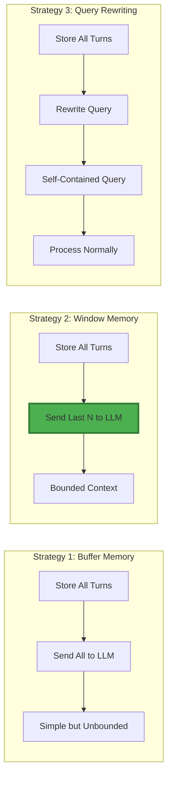
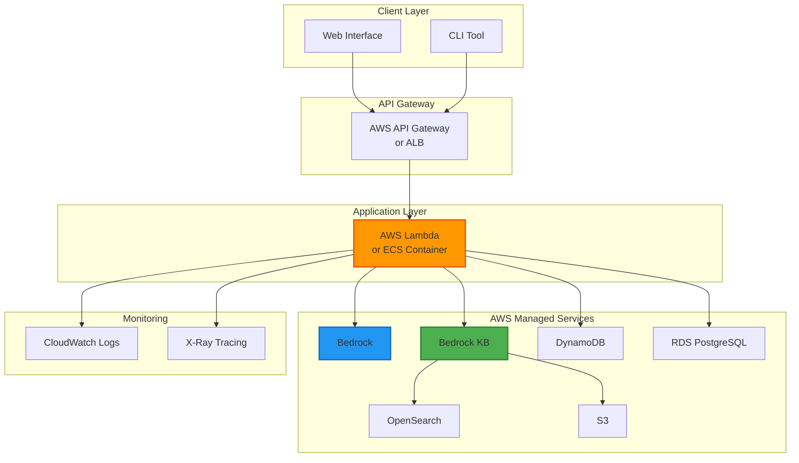

# W4 GeekBrain AI System - Architecture Diagram

## High-Level System Architecture

## Component Descriptions

### Core Components

| Component | Technology | Responsibility |
|-----------|-----------|----------------|
| **User** | Web/CLI Interface | Submits queries and receives responses |
| **API Layer** | FastAPI | HTTP endpoint, request validation, error handling |
| **Orchestrator** | Python | Routes queries, manages LLM interaction loop, coordinates RAG/Tools/Memory |
| **RAG Pipeline** | Bedrock KB Retrieve API | Retrieves relevant document chunks from knowledge base |
| **Tool Layer** | Python Functions | Executes 7 tools: DB queries, metrics API, status checks, etc. |
| **Memory Manager** | Python + DynamoDB | Stores/retrieves conversation history for multi-turn context |
| **LLM** | AWS Bedrock (Claude Sonnet) | Generates responses, decides tool calls, resolves pronouns |

### Data Sources

| Data Source | Technology | Content |
|-------------|-----------|---------|
| **S3 Bucket** | AWS S3 | 36 markdown documents (company info, policies, postmortems) |
| **Bedrock Knowledge Base** | AWS Bedrock KB | RAG service with embedding generation and retrieval |
| **OpenSearch Serverless** | AWS OpenSearch | Vector store for document embeddings |
| **Database** | SQLite/PostgreSQL | 4 CSV tables: monthly_costs, incidents, sla_targets, daily_metrics |
| **Monitoring API** | FastAPI (Local) | Live system metrics: latency, error rate, request volume |
| **Conversation State** | DynamoDB or Local | Session history for multi-turn conversations |

## Data Flow by Level

### L1: Simple RAG

### L2: Multi-Source RAG

### L3: Tool-Augmented RAG

### L4: Memory-Enabled RAG

## AWS Service Integration

## Tool Architecture

## Memory Strategy Options

## Deployment Architecture

## Key Design Decisions

### 1. Managed Services First
- **Decision**: Use AWS Bedrock KB instead of building custom RAG pipeline
- **Rationale**: Reduces complexity, faster development, production-ready infrastructure
- **Trade-off**: Less control over chunking and retrieval algorithms

### 2. Tool Orchestration Pattern
- **Decision**: Implement custom orchestration loop with tool definitions
- **Rationale**: Full control over tool execution, easier debugging, flexible error handling
- **Alternative**: Bedrock Agents (more managed but less transparent)

### 3. Window Memory Strategy
- **Decision**: Store all turns but send only last 5 to LLM
- **Rationale**: Bounded context size, predictable costs, sufficient for demo
- **Trade-off**: Loses older context beyond window

### 4. Separate Data Sources
- **Decision**: Keep Knowledge Base (S3), Database (RDS/SQLite), and Monitoring API separate
- **Rationale**: Each serves different query types, clear separation of concerns
- **Trade-off**: More components to manage

### 5. Python Implementation
- **Decision**: Use Python with boto3 for all components
- **Rationale**: Best AWS SDK support, rich ecosystem, team familiarity
- **Alternative**: TypeScript/Node.js (less mature Bedrock support)
