# W5 Evidence Pack: The Network Fortress

## Cover

| Field | Value |
|-------|-------|
| **Group** | GROUP 5 - XBrain |
| **Members** | Dang Nhat Minh |
| **Repository** | <!-- PASTE: GitHub repo link --> |
| **Prior Week Evidence** | W4: AI Agent with RAG + Tools + Memory |
| **Date** | 2026-05-15 |
| **LLM** | Claude Sonnet 4 via Amazon Bedrock |
| **Deployment** | ECS Fargate + CloudFront + ALB |

---

## Architecture Diagram

<!-- TODO: Chèn diagram cập nhật gồm:
- App VPC (10.0.0.0/16): Public subnets (ALB), Private subnets (ECS Fargate)
- Data VPC (10.1.0.0/16): Private subnets (EFS mount targets)
- VPC Peering (App ↔ Data)
- 8 VPC Endpoints (S3, DynamoDB, Bedrock Runtime, Bedrock Agent Runtime, ECR API, ECR DKR, Logs, SSM, AOSS)
- CloudFront → S3 frontend + ALB backend
- WAF v2 trên CloudFront
- API Gateway → Lambda (kb-auto-sync)
- S3 → Lambda trigger → Bedrock KB ingestion
- DLQ (SQS)
- AWS Backup vault
- NACL DENY rules trên private subnets
Gắn nhãn 5 MH rõ ràng trên diagram -->


---

## Prior Feedback Addressed

| Feedback | How W5 Addresses It |
|----------|---------------------|
| "Single EC2 instance is a single point of failure" | Multi-AZ ECS Fargate deployment with 2 running tasks across AZ-a and AZ-b, ALB health checks, auto-restart on failure |
| "Security posture needs hardening" | Hardened SG + NACL: zero 0.0.0.0/0 inbound on SSH/RDP, explicit NACL DENY rules, all AWS service traffic via VPC Endpoints (no internet egress path), WAF v2 on CloudFront |
| "No backup or disaster recovery strategy" | AWS Backup plan with daily EFS + DynamoDB snapshots, 7-day retention, restore test completed successfully with data verified |

---

## MH1: Multi-VPC Connectivity (Path A — VPC Peering)

### Choice & Rationale

**Path chosen:** A — VPC Peering

**Why VPC Peering over Transit Gateway:**
- Chỉ 2 VPCs — Transit Gateway thêm chi phí không cần thiết ($0.05/hr + data processing)
- VPC Peering là direct point-to-point, không có bandwidth bottleneck
- Non-transitive routing là security feature (least-privilege network access)
- Không dự định thêm VPC thứ 3 hoặc VPN — peering đủ dùng

### VPC Configuration

| VPC | CIDR | Purpose | Subnets |
|-----|------|---------|---------|
| App VPC | 10.0.0.0/16 | ECS Fargate, ALB, VPC Endpoints | Public: 10.0.1.0/24 (AZ-a), 10.0.2.0/24 (AZ-b); Private: 10.0.11.0/24 (AZ-a), 10.0.12.0/24 (AZ-b) |
| Data VPC | 10.1.0.0/16 | EFS mount targets (isolated storage tier) | Private: 10.1.1.0/24 (AZ-a), 10.1.2.0/24 (AZ-b) |

<!-- TODO Screenshot: AWS Console → VPC → Your VPCs → show cả 2 VPCs -->
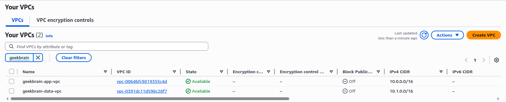

### Route Table Configuration

**App VPC Private RT → Data VPC qua Peering:**

| Destination | Target | Purpose |
|-------------|--------|---------|
| 10.0.0.0/16 | local | Intra-VPC |
| 10.1.0.0/16 | pcx-xxx | Cross-VPC to Data VPC (EFS) |

**Data VPC Private RT → App VPC qua Peering:**

| Destination | Target | Purpose |
|-------------|--------|---------|
| 10.1.0.0/16 | local | Intra-VPC |
| 10.0.0.0/16 | pcx-xxx | Cross-VPC to App VPC |

<!-- TODO Screenshot: Console → Route Tables → app-private-rt (show route 10.1.0.0/16 → pcx) -->


<!-- TODO Screenshot: Console → Route Tables → data-private-rt (show route 10.0.0.0/16 → pcx) -->
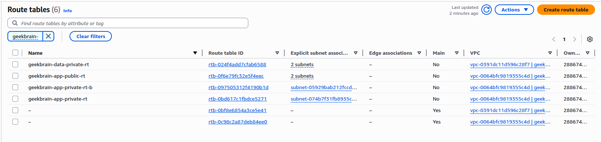

<!-- TODO Screenshot: Console → Peering Connections → Active status -->
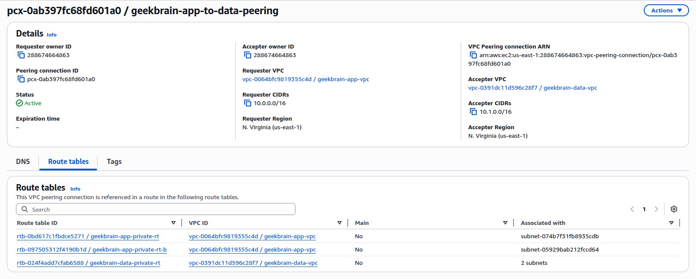

### VPC Flow Logs

**Log Groups:**
- App VPC: `/vpc/flow-logs/geekbrain-app`
- Data VPC: `/vpc/flow-logs/geekbrain-data`

**Sample entries (ACCEPT — traffic chảy qua peering):**

<!-- TODO: Chạy CLI bên dưới và paste output thật -->
```
CLI: aws logs filter-log-events \
  --log-group-name "/vpc/flow-logs/geekbrain-app" \
  --filter-pattern "ACCEPT" \
  --limit 5 \
  --query "events[].message" --output text
```

<!-- TODO Screenshot: CloudWatch → Log Groups → /vpc/flow-logs/geekbrain-app → show entries với ACCEPT -->
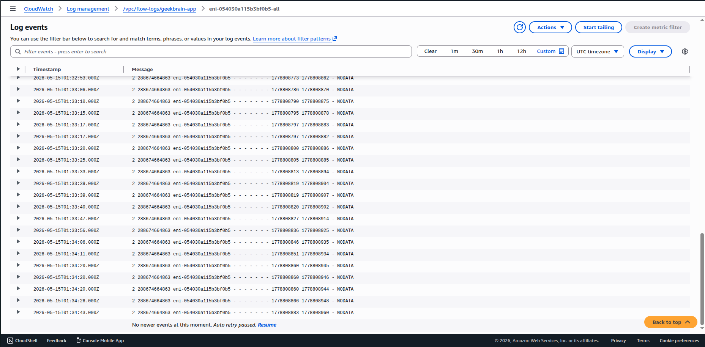

---

## MH2: Network Firewall Hardening (Path B — Hardened SG + NACL)

### Choice & Rationale

**Path chosen:** B — Hardened SG + NACL

**(a) Vì sao egress firewall không cần thiết:**

Topology hoàn toàn cô lập khỏi internet. Không có NAT Gateway trong cả 2 VPCs. Toàn bộ traffic tới AWS services đi qua VPC Endpoints:

| VPC Endpoint | Type | Service |
|--------------|------|---------|
| S3 | Gateway | Object storage (KB docs, frontend) |
| DynamoDB | Gateway | Conversation memory |
| Bedrock Runtime | Interface | Model invocation |
| Bedrock Agent Runtime | Interface | KB Retrieve |
| ECR API | Interface | Docker image manifests |
| ECR DKR | Interface | Docker image layers |
| CloudWatch Logs | Interface | ECS logging |
| SSM | Interface | Parameter Store |
| OpenSearch Serverless | Interface | Vector store for Bedrock KB |

Không có đường ra internet từ bất kỳ ECS task hay Lambda nào → Network Firewall không có traffic để inspect.

**(b) Traffic nào sẽ trigger deploy Network Firewall:**

Nếu trong production cần gọi third-party APIs (payment processor, external webhooks, package registries, hoặc AI services không có VPC Endpoint), phải thêm NAT Gateway → lúc đó bắt buộc deploy Network Firewall với domain allowlist để kiểm soát egress.

<!-- TODO Screenshot: Console → VPC → Endpoints → list tất cả 9 endpoints -->
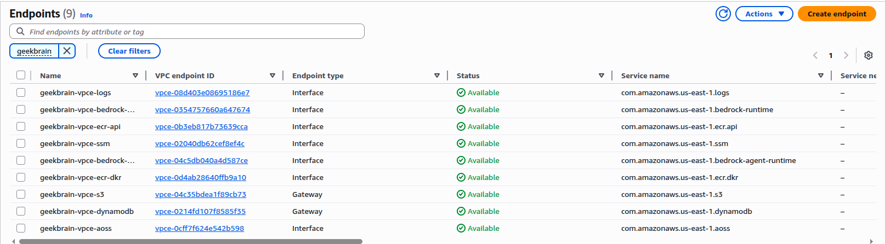

**CLI verify không có NAT Gateway:**
```bash
aws ec2 describe-nat-gateways --filter "Name=state,Values=available" \
  --query "NatGateways[].{ID:NatGatewayId,VPC:VpcId}" --output table
# Kỳ vọng: empty (không có NAT Gateway)
```

### Security Groups — Không có 0.0.0.0/0 inbound trên port 22/3389

| Security Group | Inbound Rules | Note |
|----------------|--------------|------|
| geekbrain-alb-sg | TCP 80 from CloudFront prefix list only | Không có SSH/RDP |
| geekbrain-ecs-task-sg | TCP 8001 from ALB SG only | Không có SSH/RDP |
| geekbrain-efs-sg | TCP 2049 from 10.0.11.0/24, 10.0.12.0/24 | NFS chỉ từ App VPC private subnets |
| geekbrain-vpce-sg | TCP 443 from 10.0.11.0/24, 10.0.12.0/24 | HTTPS chỉ từ private subnets |

<!-- TODO Screenshot: Console → SG → show mỗi SG inbound rules → highlight KHÔNG CÓ 0.0.0.0/0 trên 22/3389 -->
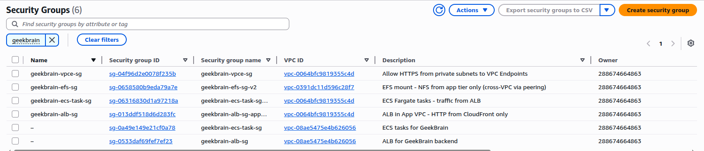

### NACL DENY Rule

<!-- TODO: Tạo custom NACL trước khi chụp screenshot.
Bước 1: Tạo manual trong Console hoặc thêm terraform resource.
Bước 2: Chụp screenshot.

CLI tạo NACL entries (nếu chưa có):
```bash
# Lấy NACL ID cho private subnets
NACL_ID=$(aws ec2 describe-network-acls \
  --filters "Name=association.subnet-id,Values=SUBNET_ID_PRIVATE_A" \
  --query "NetworkAcls[0].NetworkAclId" --output text)

# DENY SSH inbound
aws ec2 create-network-acl-entry \
  --network-acl-id $NACL_ID \
  --rule-number 50 --protocol tcp \
  --port-range From=22,To=22 \
  --cidr-block 0.0.0.0/0 \
  --rule-action deny --ingress

# DENY RDP inbound
aws ec2 create-network-acl-entry \
  --network-acl-id $NACL_ID \
  --rule-number 51 --protocol tcp \
  --port-range From=3389,To=3389 \
  --cidr-block 0.0.0.0/0 \
  --rule-action deny --ingress
```
-->

<!-- TODO Screenshot: Console → VPC → Network ACLs → show DENY rule 50 (SSH), DENY rule 51 (RDP) -->
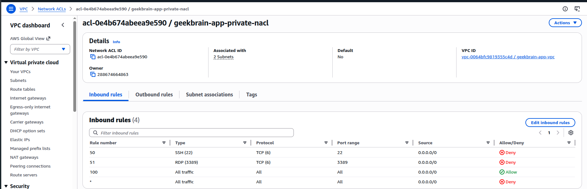

### Negative Test — Connection Refused

<!-- TODO: Test SSH connectivity từ VPC Reachability Analyzer hoặc từ public subnet instance.

CLI:
```bash
# Từ CloudShell hoặc bastion, thử kết nối SSH vào private subnet
nc -zv 10.0.11.x 22 -w 5
# Kỳ vọng: Connection timed out
```
-->

<!-- TODO Screenshot: Terminal → nc hoặc telnet tới private IP port 22 → timeout/refused -->


---

## MH3: File Storage Layer + Backup Plan

### EFS Configuration

| Setting | Value |
|---------|-------|
| File System ID | <!-- PASTE: terraform output efs_filesystem_id --> |
| Encryption | Enabled (at rest) |
| Performance Mode | generalPurpose |
| Throughput Mode | bursting |
| Location | Data VPC (10.1.0.0/16) — truy cập từ App VPC qua VPC Peering |
| Transit Encryption | ENABLED (in transit) |

**Application Content:** Knowledge Base markdown documents + SQLite database (`geekbrain.db`) phục vụ RAG pipeline và conversation memory.

<!-- TODO Screenshot: Console → EFS → geekbrain-efs → General (encrypted, generalPurpose) -->
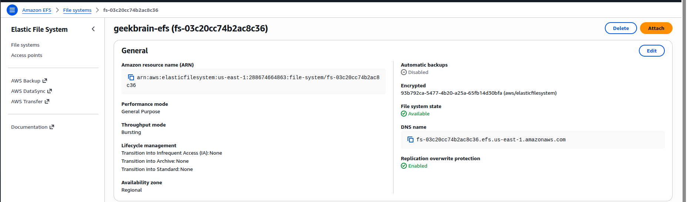

### Mount Targets — Data VPC Private Subnets

| AZ | Subnet | IP | SG |
|----|--------|----|----|
| us-east-1a | data-private (10.1.1.0/24) | auto | geekbrain-efs-sg |
| us-east-1b | data-private-b (10.1.2.0/24) | auto | geekbrain-efs-sg |

EFS SG chỉ cho phép NFS (TCP 2049) từ App VPC private subnets (`10.0.11.0/24`, `10.0.12.0/24`) qua VPC Peering. Không có 0.0.0.0/0.

<!-- TODO Screenshot: Console → EFS → Network tab → 2 mount targets trong Data VPC -->
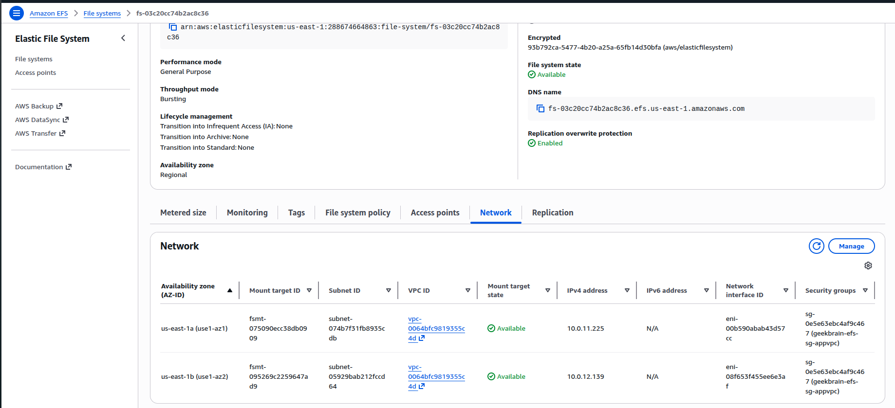

### ECS Task Volumes — File Ghi/Đọc

ECS Task Definition mount 2 EFS volumes:

| Volume | Container Path | Purpose |
|--------|---------------|---------|
| efs-knowledge-base | `/mnt/efs` | Knowledge base documents cho RAG |
| efs-database | `/mnt/efs/database` | SQLite DB (`geekbrain.db`) — Access Point UID/GID 1000 |

<!-- TODO Screenshot: ECS Console → Task Definition → geekbrain-backend → Volumes tab -->


**File read evidence (ECS Exec hoặc CloudWatch Logs):**

<!-- TODO: Chạy ECS Exec hoặc check logs:
```bash
TASK_ARN=$(aws ecs list-tasks --cluster geekbrain \
  --service-name geekbrain-backend-appvpc --query "taskArns[0]" --output text)

aws ecs execute-command --cluster geekbrain --task $TASK_ARN \
  --container geekbrain-backend --interactive \
  --command "ls -la /mnt/efs/knowledge_base/ && ls -la /mnt/efs/database/"
```
Hoặc screenshot CloudWatch Logs cho thấy app đọc từ /mnt/efs/ thành công
-->

<!-- TODO Screenshot: ECS Exec output hoặc CloudWatch log → show files in /mnt/efs/ -->


### AWS Backup Plan

| Setting | Value |
|---------|-------|
| Plan Name | geekbrain-backup-plan |
| Vault | geekbrain-backup-vault |
| Schedule | Daily at 05:00 UTC |
| Retention | 7 days |
| **Resource 1** | EFS (geekbrain-efs) |
| **Resource 2** | DynamoDB (geekbrain-conversations) |

> **Note:** Kiến trúc dùng ECS Fargate (serverless) nên không có EBS volumes. Toàn bộ persistent state nằm trên EFS (knowledge base + SQLite DB) và DynamoDB (conversations). 2 backup selections cover 100% stateful resources.

<!-- TODO Screenshot: Console → AWS Backup → Backup plans → geekbrain-backup-plan → Rules + Protected resources -->


### Recovery Points

<!-- TODO Screenshot: Console → AWS Backup → Backup vault → geekbrain-backup-vault → Recovery points (Status: COMPLETED) -->


**CLI trigger on-demand backup (nếu chưa có recovery point):**
```bash
# Backup EFS
aws backup start-backup-job \
  --backup-vault-name geekbrain-backup-vault \
  --resource-arn arn:aws:elasticfilesystem:us-east-1:ACCOUNT_ID:file-system/FS_ID \
  --iam-role-arn arn:aws:iam::ACCOUNT_ID:role/geekbrain-backup-role

# Backup DynamoDB
aws backup start-backup-job \
  --backup-vault-name geekbrain-backup-vault \
  --resource-arn arn:aws:dynamodb:us-east-1:ACCOUNT_ID:table/geekbrain-conversations \
  --iam-role-arn arn:aws:iam::ACCOUNT_ID:role/geekbrain-backup-role
```

### Restore Test (MANDATORY)

**Step 1: Trigger restore từ recovery point**

```bash
# Lấy recovery point mới nhất
RECOVERY_POINT=$(aws backup list-recovery-points-by-backup-vault \
  --backup-vault-name geekbrain-backup-vault \
  --query "RecoveryPoints[?ResourceType=='EFS'] | sort_by(@, &CreationDate) | [-1].RecoveryPointArn" \
  --output text)

# Start restore
aws backup start-restore-job \
  --recovery-point-arn $RECOVERY_POINT \
  --iam-role-arn arn:aws:iam::ACCOUNT_ID:role/geekbrain-backup-role \
  --metadata '{"file-system-id":"NEW_FS_ID","Encrypted":"true","PerformanceMode":"generalPurpose","newFileSystem":"true","CreationToken":"restore-test-w5"}'
```

**Step 2: Restore job completed**

<!-- TODO: Paste output thật:
```bash
aws backup describe-restore-job --restore-job-id RESTORE_JOB_ID
# Status: COMPLETED
```
-->

<!-- TODO Screenshot: Console → AWS Backup → Restore jobs → Status: COMPLETED -->


**Step 3: Verify data on restored resource**

<!-- TODO: Mount restored EFS và verify data:
```bash
# Mount EFS mới
sudo mount -t efs fs-RESTORED:/ /mnt/restore-test
ls -la /mnt/restore-test/knowledge_base/
ls -la /mnt/restore-test/database/
# Verify: tất cả files có mặt, database readable
```
-->

| Field | Value |
|-------|-------|
| Backup Job ID | <!-- PASTE --> |
| Restore Job ID | <!-- PASTE --> |
| Restore Status | COMPLETED |
| Data Verified | <!-- PASTE: X/X documents present --> |

<!-- TODO Screenshot: Terminal → ls restored EFS → files visible -->


---

## MH4: API Gateway + Auth + Throttling

### Resource Tree

```
geekbrain-sync-api (REST API, Regional)
└── /sync (Resource)
    └── POST (Method)
        ├── Authorization: API Key Required
        ├── Integration: Lambda Proxy → geekbrain-kb-auto-sync
        └── Usage Plan: geekbrain-sync-plan
            ├── Rate: 10 req/s
            ├── Burst: 20
            └── Quota: 1000/day
```

<!-- TODO Screenshot: Console → API Gateway → geekbrain-sync-api → Resources → /sync POST -->


### Usage Plan & Throttling

| Setting | Value |
|---------|-------|
| API Name | geekbrain-sync-api |
| Endpoint Type | Regional |
| Stage | prod |
| Auth Method | API Key (x-api-key header) |
| Rate Limit | 10 requests/second |
| Burst Limit | 20 |
| Daily Quota | 1000 requests |

<!-- TODO Screenshot: Console → API Gateway → Usage Plans → geekbrain-sync-plan → Throttle & Quota settings -->


### Test: Authenticated Request (200 OK)

<!-- TODO: Chạy curl với API key:
```bash
API_URL=$(cd w5/terraform && terraform output -raw api_gateway_url)
API_KEY=$(cd w5/terraform && terraform output -raw api_key_value)

curl -v -X POST "$API_URL" \
  -H "x-api-key: $API_KEY" \
  -H "Content-Type: application/json" \
  -d '{}' 2>&1
```

NOTE: Nếu nhận 502, cần fix Lambda handler trả đúng format:
{
  "statusCode": 200,
  "headers": {"Content-Type": "application/json"},
  "body": "{\"message\": \"sync triggered\"}"
}
-->

```bash
$ curl -s -w "\nHTTP Status: %{http_code}\n" \
    -X POST -H "x-api-key: <REDACTED>" \
    https://XXXXXXXXXX.execute-api.us-east-1.amazonaws.com/prod/sync

# Kỳ vọng: HTTP 200
```

<!-- TODO Screenshot: Terminal → curl output → HTTP 200 -->
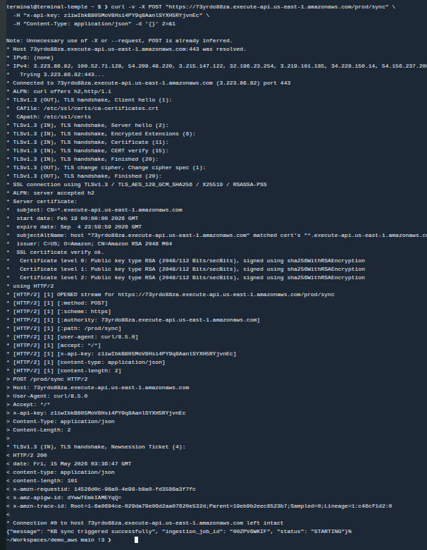

### Test: Unauthenticated Request (403 Forbidden)

```bash
$ curl -s -w "\nHTTP Status: %{http_code}\n" \
    -X POST https://XXXXXXXXXX.execute-api.us-east-1.amazonaws.com/prod/sync

{"message":"Forbidden"}
HTTP Status: 403
```

<!-- TODO Screenshot: Terminal → curl output → HTTP 403 Forbidden -->


---

## MH5: Serverless Scaling Pattern

### Pattern Chosen: Reserved Concurrency + Async Invocation + DLQ

**Applied to:** `geekbrain-kb-auto-sync` — Lambda thật đang xử lý S3 events để trigger Bedrock KB ingestion.

**Why this combination:**
- Lambda triggered bởi S3 events (inherently async invocation) — khi user upload documents vào knowledge base
- Reserved Concurrency = 2: cap function để không nuốt hết account concurrency limit khi bulk upload (nhiều files cùng lúc)
- DLQ (SQS): capture failed invocations khi MaxRetryAttempts = 0 — failures vào DLQ ngay, không retry vô nghĩa
- S3-event-triggered pattern: `PutObject/RemoveObject` trên prefix `knowledge_base/*.md` → Lambda → Bedrock StartIngestionJob

### Configuration

| Setting | Value |
|---------|-------|
| Function | geekbrain-kb-auto-sync-dev |
| Reserved Concurrency | 2 |
| Max Retry Attempts | 0 |
| DLQ | SQS: geekbrain-kb-sync-dlq (14-day retention, SSE enabled) |
| Trigger | S3 ObjectCreated/ObjectRemoved on `knowledge_base/*.md` |

<!-- TODO Screenshot: Console → Lambda → geekbrain-kb-auto-sync → Configuration → Concurrency → Reserved: 2 -->
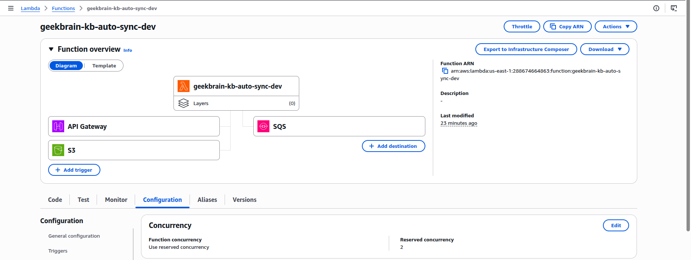

<!-- TODO Screenshot: Console → Lambda → Configuration → Asynchronous invocation → MaxRetry=0, OnFailure=DLQ -->


<!-- TODO Screenshot: Console → Lambda → Configuration → Destinations → On failure → SQS DLQ ARN -->
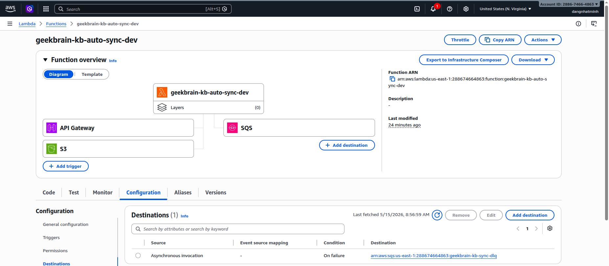

### S3 Event Trigger

<!-- TODO Screenshot: Console → S3 → geekbrain-kb-dev → Properties → Event notifications → Lambda trigger -->


### Throttle Evidence (Reserved Concurrency)

**How tested:** Upload 5 files đồng thời (vượt reserved concurrency = 2)

```bash
for i in {1..5}; do
  aws s3 cp test_$i.md s3://geekbrain-kb-dev/knowledge_base/test_$i.md &
done
wait

# Check Throttles metric
aws cloudwatch get-metric-statistics --namespace AWS/Lambda \
  --metric-name Throttles \
  --dimensions Name=FunctionName,Value=geekbrain-kb-auto-sync-dev \
  --start-time $(date -u -d '15 minutes ago' +%Y-%m-%dT%H:%M:%S) \
  --end-time $(date -u +%Y-%m-%dT%H:%M:%S) \
  --period 60 --statistics Sum --output table
```

<!-- TODO Screenshot: CloudWatch → Metrics → Lambda → Throttles > 0 -->


### DLQ Message Evidence

```bash
# Gây failure: invoke với payload invalid
aws lambda invoke \
  --function-name geekbrain-kb-auto-sync-dev \
  --invocation-type Event \
  --payload '{"Records":[{"s3":{"bucket":{"name":"nonexistent"},"object":{"key":"fake.md"}}}]}' \
  /dev/null

# Đợi 2-3 phút, check DLQ
aws sqs receive-message \
  --queue-url $(cd w5/terraform && terraform output -raw dlq_url) \
  --max-number-of-messages 1 \
  --query "Messages[0].Body" --output text
```

<!-- TODO Screenshot: Console → SQS → geekbrain-kb-sync-dlq → Poll for messages → show message body -->
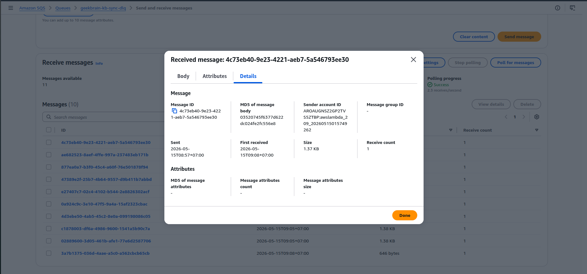

---

## Application Carry-Forward Verification

### App Running End-to-End

| Component | URL |
|-----------|-----|
| Frontend | <!-- PASTE: terraform output frontend_url --> |
| Backend (via CF) | `https://dXXXXXX.cloudfront.net/query/stream` |
| Health Check | `https://dXXXXXX.cloudfront.net/health` |
| API Gateway | <!-- PASTE: terraform output api_gateway_url --> |

**Health Check:**
```bash
$ curl -s https://dXXXXXX.cloudfront.net/health
{"status":"healthy","knowledge_base_configured":true}
```

**ECS Service Status:**
```bash
$ aws ecs describe-services --cluster geekbrain --services geekbrain-backend-appvpc \
    --query "services[0].{Status:status,Running:runningCount,Desired:desiredCount}"
{"Status": "ACTIVE", "Running": 2, "Desired": 2}
```

<!-- TODO Screenshot: Browser → CloudFront URL → GeekBrain UI loaded, ask a question, get RAG response -->


### Bedrock KB Retrieval (RAG)

<!-- TODO Screenshot: Browser hoặc curl → query endpoint → response với citations from KB -->


### DynamoDB — Conversation Stored

<!-- TODO Screenshot: Console → DynamoDB → geekbrain-conversations → Items → show sessions -->


---

## Negative Security Tests

| # | MH | Test | Expected | Actual | Evidence |
|---|----|----|----------|--------|----------|
| 1 | MH1 | Cross-VPC unauthorized port (not NFS 2049) | Blocked | EFS SG only allows TCP 2049 from app-private CIDRs | SG rules |
| 2 | MH2 | No internet egress path (no NAT GW) | No route | `aws ec2 describe-nat-gateways` returns empty | VPC Endpoints only |
| 3 | MH2 | SSH to private subnet (port 22) | Timeout | NACL DENY + no SSH SG rule | NACL screenshot |
| 4 | MH3 | EFS mount from unauthorized source | Timeout | EFS SG restricts NFS to 10.0.11.0/24, 10.0.12.0/24 | SG rule |
| 5 | MH4 | API Gateway without API key | HTTP 403 | `{"message":"Forbidden"}` | curl screenshot |
| 6 | MH5 | Lambda beyond reserved concurrency | Throttled | Throttles > 0 in CloudWatch | Throttle metric |
| 7 | Bonus | Direct ALB access (bypass CloudFront) | HTTP 403 | ALB returns 403 without X-CloudFront-Secret header | curl screenshot |
| 8 | Bonus | WAF — SQL injection attempt | Blocked | WAF AWSManagedRulesSQLiRuleSet blocks request | curl screenshot |
| 9 | Bonus | S3 direct access | HTTP 403 | Public access block enabled | curl screenshot |

### Test Commands

```bash
# Test 2: No NAT Gateway
aws ec2 describe-nat-gateways \
  --filter "Name=state,Values=available" --output table
# Kỳ vọng: empty

# Test 5: API no key
curl -s -w "HTTP %{http_code}\n" \
  -X POST https://XXXXXXXXXX.execute-api.us-east-1.amazonaws.com/prod/sync
# Kỳ vọng: 403

# Test 7: ALB direct
curl -s -w "HTTP %{http_code}\n" "http://$(cd w5/terraform && terraform output -raw alb_dns_name)/health"
# Kỳ vọng: 403 (missing X-CloudFront-Secret)

# Test 8: WAF SQLi
curl -s -w "HTTP %{http_code}\n" \
  "https://dXXXXXX.cloudfront.net/api/test?q=1' OR 1=1 --"
# Kỳ vọng: 403 (WAF block)

# Test 9: S3 direct
curl -s -w "HTTP %{http_code}\n" \
  "https://geekbrain-frontend-dev.s3.amazonaws.com/index.html"
# Kỳ vọng: 403 (public access block)
```

<!-- TODO Screenshot: Terminal → run negative tests → show expected HTTP codes -->


---

## Bonus: WAF v2 + CloudWatch Monitoring

### WAF v2 trên CloudFront

| Rule | Type | Action |
|------|------|--------|
| AWSManagedRulesCommonRuleSet | Managed | Block (XSS, path traversal) |
| AWSManagedRulesSQLiRuleSet | Managed | Block (SQL injection) |
| AWSManagedRulesKnownBadInputsRuleSet | Managed | Block (Log4j, etc.) |
| rate-limit | Custom | Block > 2000 req/5min per IP |

<!-- TODO Screenshot: Console → WAF → geekbrain-waf → Rules tab -->


### CloudWatch Alarms (8 alarms)

| Alarm | Metric | Threshold |
|-------|--------|-----------|
| ECS CPU High | CPUUtilization | > 80% for 10min |
| ECS Memory High | MemoryUtilization | > 80% for 10min |
| ECS No Running Tasks | RunningTaskCount | < 1 |
| ALB 5xx Spike | HTTPCode_Target_5XX_Count | > 10 in 5min |
| ALB Latency High | TargetResponseTime | > 5s for 15min |
| ALB Unhealthy Hosts | UnHealthyHostCount | > 0 |
| DynamoDB Throttled | ThrottledRequests | > 5 in 5min |
| Lambda Errors | Errors | > 3 in 5min |
| WAF Blocked Spike | BlockedRequests | > 100 in 5min |
| DLQ Messages | ApproximateNumberOfMessagesVisible | > 0 |

All alarms → SNS email notification.

<!-- TODO Screenshot: Console → CloudWatch → Alarms → all geekbrain-* (State: OK) -->


---

## Decision Log

### Decision 1: VPC Endpoints thay vì NAT Gateway

| | |
|---|---|
| **Chose** | 9 VPC Endpoints (Gateway + Interface) |
| **Over** | NAT Gateway + Network Firewall |
| **Why** | ECS tasks chỉ gọi AWS services (Bedrock, S3, DynamoDB, ECR, Logs, SSM, OpenSearch). VPC Endpoints giữ traffic trên AWS backbone — không cần internet path. Tiết kiệm NAT Gateway cost (~$32/month + data processing) và loại bỏ hoàn toàn egress attack surface. |
| **Trade-off** | Nếu cần gọi external API sau này, phải thêm NAT + Firewall. Hiện tại: zero egress = zero risk. |

### Decision 2: EFS trong Data VPC (cross-VPC qua Peering)

| | |
|---|---|
| **Chose** | EFS mount targets trong Data VPC, ECS tasks trong App VPC truy cập qua VPC Peering |
| **Over** | EFS trong cùng App VPC |
| **Why** | Tách storage tier ra VPC riêng: (1) demonstrate VPC Peering use case thực tế cho MH1, (2) network isolation — EFS SG chỉ allow NFS từ App VPC CIDRs, (3) nếu cần thêm consumers (analytics VPC) sau này, chỉ thêm peering + route. |
| **Trade-off** | Thêm latency nhỏ qua peering; gained isolation + clear MH1 demonstration |

### Decision 3: CloudFront as Unified Entry Point

| | |
|---|---|
| **Chose** | CloudFront proxying frontend (S3) + backend (ALB) via path-based routing |
| **Over** | Separate domains |
| **Why** | Single HTTPS domain. Shared secret header (`X-CloudFront-Secret`) ngăn truy cập ALB trực tiếp. WAF v2 bảo vệ cả frontend lẫn backend. |
| **Trade-off** | Cache behavior complexity; gained single origin, simpler CORS, centralized security |

---

## Reflection

**Hardest part:**
Thiết kế VPC Endpoint topology phải cover đúng tất cả AWS services mà ECS tasks cần. Thiếu 1 endpoint (vd: ECR DKR) → task không pull được image, lỗi rất khó debug vì không có error message rõ ràng — container chỉ stuck ở PENDING. Phải trace từ ECS events → xác định service nào thiếu endpoint → thêm Interface Endpoint + SG rule.

**What I'd do differently:**
Set up VPC Flow Logs từ đầu trước khi build networking. Khi debug connectivity giữa App VPC ↔ Data VPC (EFS mount qua peering), Flow Logs cho thấy ngay traffic bị reject ở đâu. Không có Flow Logs thì phải đoán mù.

**If I had one more day:**
Thêm Transit Gateway để demonstrate scalability path, implement Vault Lock (Compliance Mode) cho backup vault, và chạy Lambda Power Tuning trên function MH4 để tìm optimal memory configuration.

---

## Screenshot Collection Checklist

| # | Screenshot | Source | Priority | Status |
|---|-----------|--------|----------|--------|
| 1 | Architecture Diagram (5 MH labeled) | Draw.io / Lucidchart | **CRITICAL** | [ ] |
| 2 | MH1: VPC list (2 VPCs) | Console: VPC | HIGH | [ ] |
| 3 | MH1: App VPC route table (peering route) | Console: Route Tables | HIGH | [ ] |
| 4 | MH1: Data VPC route table (peering route) | Console: Route Tables | HIGH | [ ] |
| 5 | MH1: Peering connection (Active) | Console: Peering | HIGH | [ ] |
| 6 | MH1: Flow Logs sample entry (ACCEPT) | Console: CloudWatch Logs | HIGH | [ ] |
| 7 | MH2: VPC Endpoints list (9 endpoints) | Console: Endpoints | HIGH | [ ] |
| 8 | MH2: Security Groups (no 0.0.0.0/0:22) | Console: SG | HIGH | [ ] |
| 9 | MH2: NACL DENY rules (SSH+RDP) | Console: NACLs | HIGH | [ ] |
| 10 | MH2: Negative test (SSH timeout) | Terminal | HIGH | [ ] |
| 11 | MH3: EFS details (encrypted) | Console: EFS | HIGH | [ ] |
| 12 | MH3: Mount targets in Data VPC | Console: EFS Network | MEDIUM | [ ] |
| 13 | MH3: ECS Task volumes | Console: ECS Task Def | HIGH | [ ] |
| 14 | MH3: File read evidence (ECS Exec / logs) | Terminal / CloudWatch | HIGH | [ ] |
| 15 | MH3: Backup plan (rules + resources) | Console: AWS Backup | HIGH | [ ] |
| 16 | MH3: Recovery points (COMPLETED) | Console: Backup Vault | HIGH | [ ] |
| 17 | MH3: Restore job COMPLETED | Console: Restore Jobs | **CRITICAL** | [ ] |
| 18 | MH3: Restored data verified | Terminal | **CRITICAL** | [ ] |
| 19 | MH4: API Gateway resources | Console: API GW | MEDIUM | [ ] |
| 20 | MH4: Usage plan (throttle+quota) | Console: API GW | HIGH | [ ] |
| 21 | MH4: curl 200 (with API key) | Terminal | HIGH | [ ] |
| 22 | MH4: curl 403 (no API key) | Terminal | HIGH | [ ] |
| 23 | MH5: Reserved concurrency = 2 | Console: Lambda | HIGH | [ ] |
| 24 | MH5: Async config (retry=0, DLQ) | Console: Lambda | HIGH | [ ] |
| 25 | MH5: S3 event trigger | Console: S3 | MEDIUM | [ ] |
| 26 | MH5: Throttles metric > 0 | Console: CloudWatch | HIGH | [ ] |
| 27 | MH5: DLQ message | Console: SQS | HIGH | [ ] |
| 28 | App: End-to-end (browser) | Browser | HIGH | [ ] |
| 29 | App: Bedrock retrieval | Browser / Terminal | MEDIUM | [ ] |
| 30 | App: DynamoDB data | Console: DynamoDB | MEDIUM | [ ] |
| 31 | Negative: ALB direct → 403 | Terminal | MEDIUM | [ ] |
| 32 | Negative: WAF block | Terminal | MEDIUM | [ ] |
| 33 | Bonus: WAF rules | Console: WAF | LOW | [ ] |
| 34 | Bonus: CloudWatch alarms | Console: CloudWatch | LOW | [ ] |

### Thứ tự thực hiện

1. **Deploy `terraform apply`** (nếu chưa)
2. **Tạo NACL DENY rules** (manual console hoặc thêm terraform)
3. **Trigger on-demand backup** → chờ COMPLETED
4. **Trigger restore job** → chờ COMPLETED → verify data
5. **Fix Lambda handler** (nếu cần 200 thay vì 502 cho MH4)
6. **Chụp screenshots theo thứ tự checklist**
7. **Upload 5 files đồng thời** → chụp Throttles metric
8. **Gây Lambda failure** → chụp DLQ message
9. **Chạy negative tests** → chụp kết quả
10. **Vẽ architecture diagram** → label 5 MH
11. **Replace tất cả `<!-- TODO -->` bằng screenshots thật**
12. **Commit + push** → paste link vào slide
