# W7 Evidence Pack — DocHub AI

## 1. Cover

| Field           | Detail                                               |
| --------------- | ---------------------------------------------------- |
| **Group**       | G5                                                   |
| **Members**     | Minh - Quang Vinh - Hoang - Nam - Quyen - Thuy - Son |
| **Live URL**    | https://d1vettctjkzmbg.cloudfront.net                |
| **Repo**        | TODO: _Điền GitHub repo URL_                         |
| **Domain**      | C — ProductivityTech: "AI Document Hub"              |
| **Total Spend** | ~$10.45 (as of Day 1 EOD — Budget screenshot)        |
| **Region**      | us-east-1 (N. Virginia)                              |
| **AWS Account** | 946232032779                                         |

---

## 2. Pitch and Vision

### Use Case

**DocHub AI** là nền tảng AI Document Hub multi-tenant, cho phép các tổ chức upload tài liệu (hợp đồng, báo cáo, policy) và sử dụng AI để tìm kiếm, hỏi đáp, tóm tắt nội dung trên toàn bộ kho tài liệu.

### Target User

Legal teams, compliance officers, knowledge workers quản lý thư viện tài liệu lớn — cần tìm kiếm nhanh thông tin xuyên suốt nhiều tài liệu mà không phải đọc từng file.

### Why This Domain Matters

Enterprise document search là bài toán thực tế — các công ty luật, ngân hàng, và tổ chức tuân thủ đều cần truy vấn nhanh trên hàng trăm tài liệu. AI-powered search giảm thời gian từ hàng giờ xuống vài giây.

### Real-world Parallels

Harvey AI (legal), Hebbia, Ironclad (contracts), Glean Workspace, Microsoft Copilot for M365.

### Multi-tenancy

Mỗi tenant (company_a, company_b) có Knowledge Base workspace riêng biệt. Dữ liệu được isolate ở mức S3 prefix + DynamoDB partition + Bedrock KB metadata filter bằng `workspace_id`.

---

## 3. Architecture

### 3.1 Final Architecture Diagram

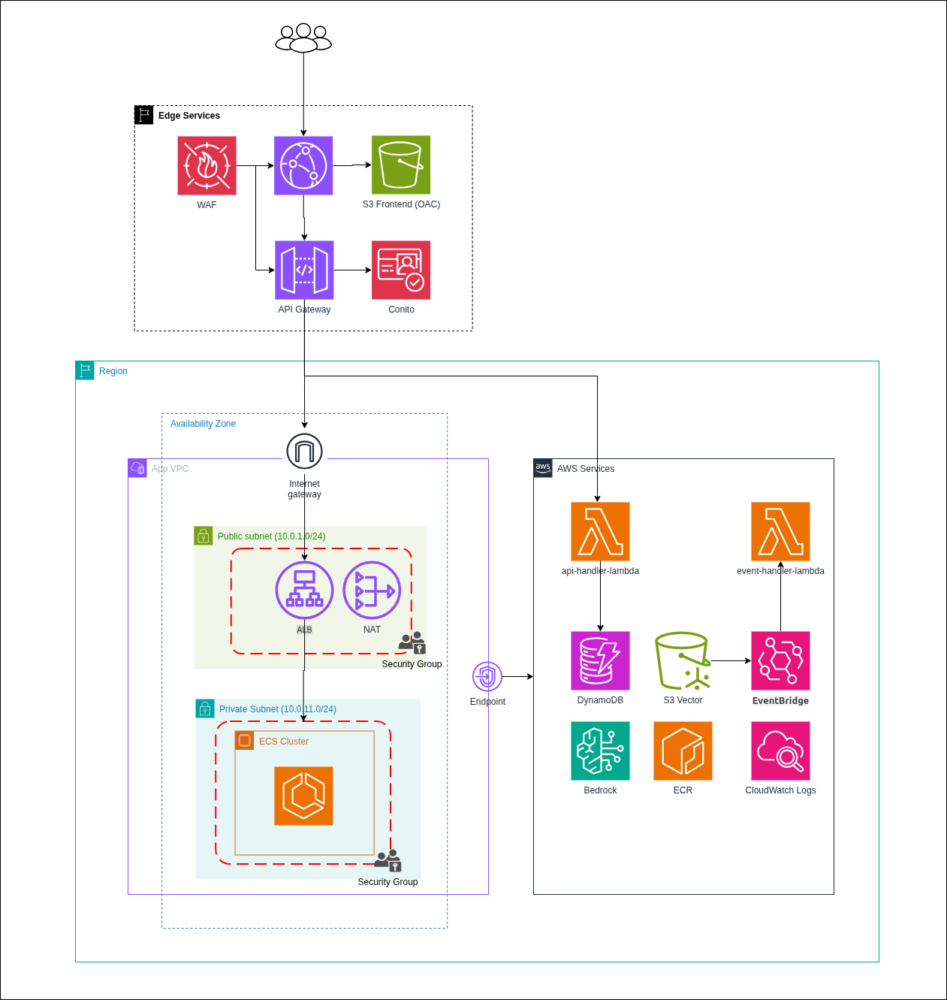

### 3.1.1 Live Demo — End-to-End Happy Path

User đăng nhập (Cognito) → Upload PDF (S3 pre-signed URL) → Bedrock KB ingestion (Haiku parse + Titan embed → S3 Vectors) → AI Chat với source citations:

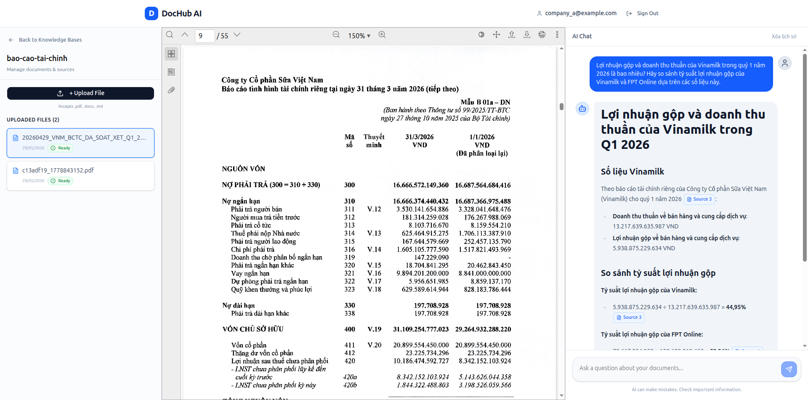

> Ảnh trên cho thấy: workspace `bao-cao-tai-chinh`, 2 files uploaded (status: Ready), user hỏi "Lợi nhuận gộp và doanh thu thuần của Vinamilk trong quý 1 năm 2026?" → AI trả lời chính xác với **Source 3** citation, trích dẫn số liệu từ báo cáo tài chính Vinamilk Q1/2026.

### 3.1.2 Data Persistence — Cross-Session Verification


> Fresh session (cùng account `company_a@example.com`) — documents đã upload trước đó vẫn hiển thị với status Ready. AI vẫn trả lời dựa trên knowledge base đã index. Chứng minh DynamoDB (metadata) + S3 (files) + S3 Vectors (embeddings) persist across sessions.

### 3.2 Service Decisions Table — 7 Mandatory Capabilities

| #   | Capability              | Service Chosen                                                                                                                         | Rationale                                                                                                                                                                                                                                                                                                |
| --- | ----------------------- | -------------------------------------------------------------------------------------------------------------------------------------- | -------------------------------------------------------------------------------------------------------------------------------------------------------------------------------------------------------------------------------------------------------------------------------------------------------- |
| 1   | **User-Facing Entry**   | **CloudFront + S3 (static)** + **API Gateway REST** (API entry)                                                                        | CloudFront cung cấp HTTPS miễn phí trên domain `*.cloudfront.net`, global CDN, OAC cho S3 bảo mật. API Gateway REST xử lý auth (Cognito Authorizer) + proxy tới ALB/ECS.                                                                                                                                 |
| 2   | **Application Compute** | **ECS Fargate** (AI Backend, 256 CPU / 512MB)                                                                                          | Backend cần long-running process cho RAG pipeline (retrieve + generate có thể >30s). Lambda bị giới hạn 29s timeout qua API Gateway — ECS Fargate không có giới hạn này. Container hóa giúp giữ Bedrock client connection pool.                                                                          |

**Evidence — ECS Cluster:** `dochubx-cluster`, Status: Active, 1 Service active, 1 Task RUNNING (Fargate, `dochubx-ai-backend:5`):

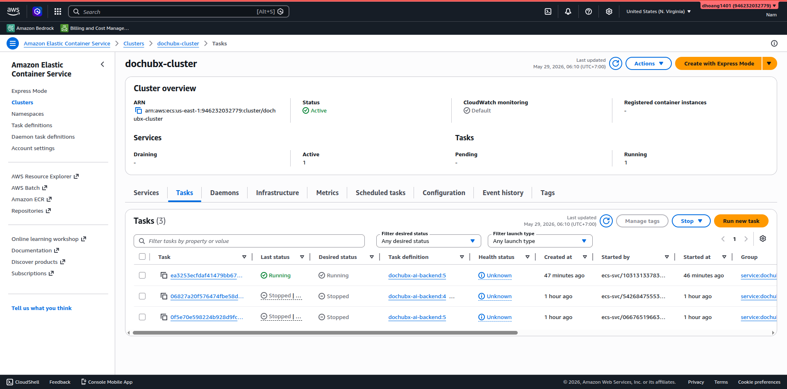

| 3   | **AI / ML Feature**     | **Bedrock Knowledge Base** (RAG) + **Claude Haiku 4.5** (generation) + **Titan Embed v2** (embeddings) + **S3 Vectors** (vector store) | RAG pipeline: upload PDF → Bedrock KB ingestion (Haiku parse + Titan embed) → S3 Vectors → retrieve_and_generate với tenant_id filter. End-to-end document Q&A.                                                                                                                                          |

**Evidence — Bedrock KB:** `dochubx-ai-kb`, Data source `dochubx-ai-s3-datasource` (Status: Available), Embedding model: Titan Text Embeddings v2 (1024 dimensions), Parsing: Claude Haiku 4.5, Chunking: Fixed-size. Tags: `Project=dochubx-g5, Team=G5, Owner=group5, Environment=hackathon`.

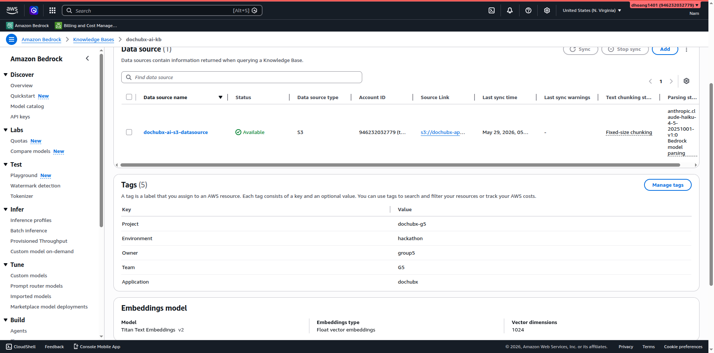

| 4   | **Data Persistence**    | **DynamoDB** (2 tables: Workspaces + Documents)                                                                                        | Document metadata luôn được query theo `document_id` (single-key lookup) hoặc scan theo workspace. Không cần JOIN/aggregation. PAY_PER_REQUEST mode tối ưu chi phí hackathon.                                                                                                                            |
| 5   | **Object Storage**      | **S3** (`dochubx-app-data`)                                                                                                            | Lưu trữ file PDF upload theo prefix `{workspace_id}/docs/{doc_id}.pdf`. Block Public Access enabled. CORS configured cho pre-signed URL upload từ frontend.                                                                                                                                              |

**Evidence — S3 Objects:** Bucket `dochubx-app-data`, prefix `bao-cao-tai-chinh/` chứa 2 workspace folders (UUID-based), mỗi folder chứa file PDF đã upload:

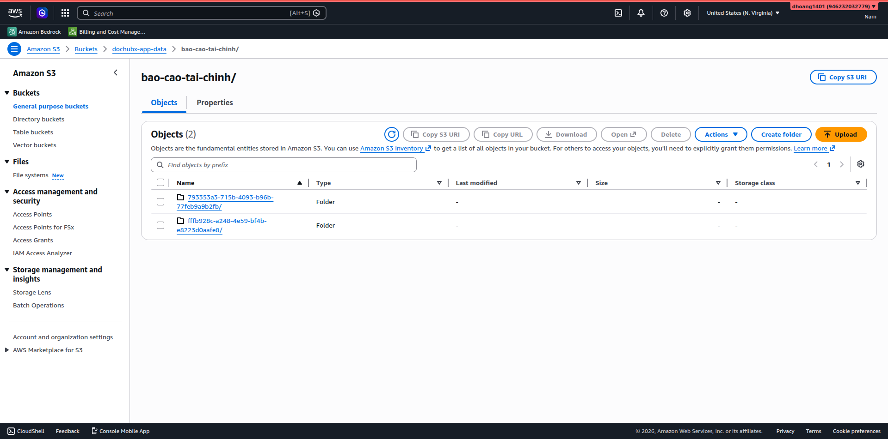

| 6   | **Network Foundation**  | **VPC** (10.0.0.0/16) + Public/Private subnets + NAT GW + VPC Endpoints                                                                | ECS Fargate chạy trong private subnet (10.0.3.0/24, 10.0.4.0/24). ALB ở public subnet. ECS SG chỉ cho phép traffic từ ALB SG trên port 8000. S3/DynamoDB dùng Gateway Endpoint (miễn phí).                                                                                                               |

**Evidence — VPC Resource Map:** `dochubx-vpc` (10.0.0.0/16, State: Available), 4 Subnets (2 public + 2 private across us-east-1a/1b), 3 Route Tables, 4 Network Connections (IGW, NAT, 2 VPC Endpoints):

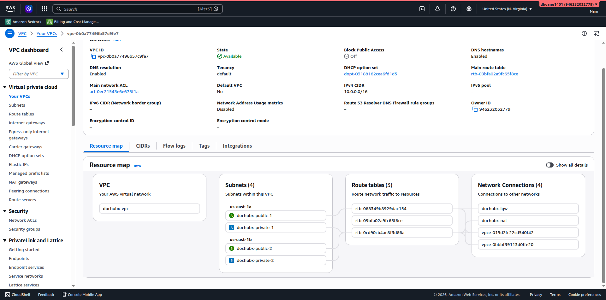

| 7   | **Identity & Access**   | **Cognito User Pool** + **IAM least-privilege roles**                                                                                  | Cognito xử lý user auth (email/password), issue JWT token. API Gateway Cognito Authorizer validates JWT. IAM roles scoped: ECS task role chỉ có bedrock:InvokeModel, bedrock:Retrieve\*, s3:GetObject, cloudwatch:PutMetricData. Lambda role chỉ có DynamoDB CRUD + S3 CRUD + bedrock:StartIngestionJob. |

**Evidence — Cognito User Pool:** `dochubx-user-pool`, 2 users (`company_a@example.com`, `company_b@example.com`), cả hai Confirmed + Enabled, Email verified = Yes:

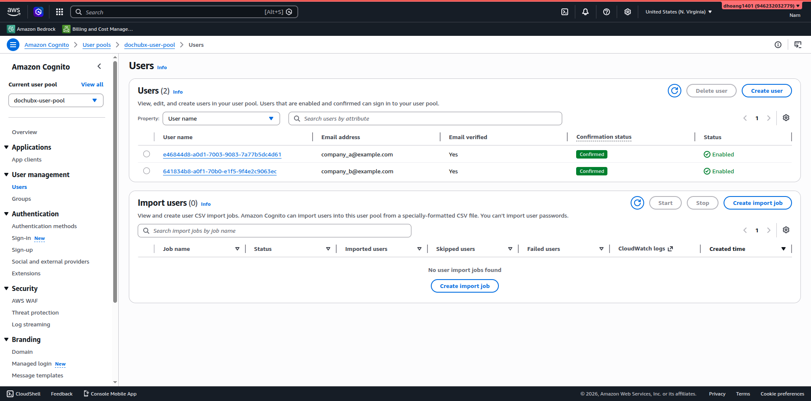


### 3.3 Trade-offs

**Trade-off 1: ECS Fargate vs Lambda cho AI Backend**

- **Chọn:** ECS Fargate (256 CPU / 512MB, 1 task)
- **Bỏ:** Lambda
- **Lý do:** RAG pipeline (retrieve → generate) mất 3-5 giây. API Gateway + Lambda có hard limit 29s integration timeout. ECS không có giới hạn này. Thêm vào đó, ECS giữ được connection pool tới Bedrock — không bị cold start mỗi request.
- **Đánh đổi:** ECS Fargate chạy 24/7 → ~$0.50/ngày dù idle. Lambda chỉ tính tiền khi invoke. Chấp nhận chi phí này vì reliability quan trọng hơn trong demo.

**Trade-off 2: S3 Vectors vs OpenSearch Serverless cho KB Vector Store**

- **Chọn:** S3 Vectors
- **Bỏ:** OpenSearch Serverless
- **Lý do:** OpenSearch Serverless minimum 2 OCU × $0.24/hr = $11.52/ngày → $23+ cho 48h. S3 Vectors gần $0 ở scale hackathon. Tiết kiệm ~$23 (23% budget).
- **Đánh đổi:** S3 Vectors mới, ít tài liệu hơn OpenSearch. Chấp nhận vì scale hackathon nhỏ.

**Trade-off 3: NAT Gateway vs chỉ VPC Endpoints**

- **Chọn:** NAT Gateway + VPC Gateway Endpoints (S3, DynamoDB)
- **Bỏ:** Chỉ dùng VPC Endpoints (không NAT)
- **Lý do:** ECS container cần pull image từ ECR (qua internet hoặc ECR VPC endpoint). NAT Gateway đơn giản nhất để đảm bảo ECS tasks trong private subnet có outbound internet cho ECR pull + Bedrock API. ECR Interface Endpoint + Bedrock Interface Endpoint sẽ cần thêm $0.01/hr mỗi endpoint.
- **Đánh đổi:** NAT Gateway tốn ~$1.08/ngày. Có thể thay bằng VPC Interface Endpoints cho ECR + Bedrock để tiết kiệm nếu chạy dài hạn.

---

## 4. Cost Discipline

### 4.1 Pre-flight Safety ✅

| Check                  | Status                                                                | Evidence                                 |
| ---------------------- | --------------------------------------------------------------------- | ---------------------------------------- |
| MFA on root            | ✅ Enabled                                                            | 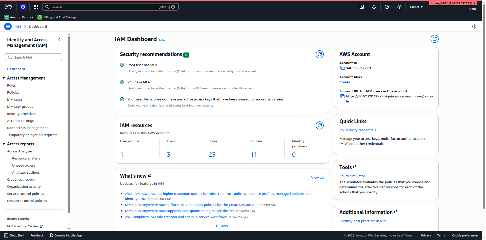      |
| Budget Alert $100      | ✅ OK, Healthy                                                        | 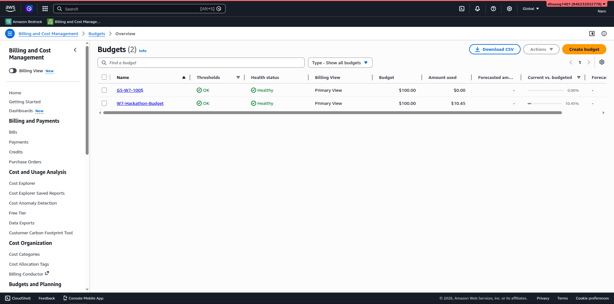  |
| Cost Anomaly Detection | ✅ Enabled, $8.12 MTD                                                 | 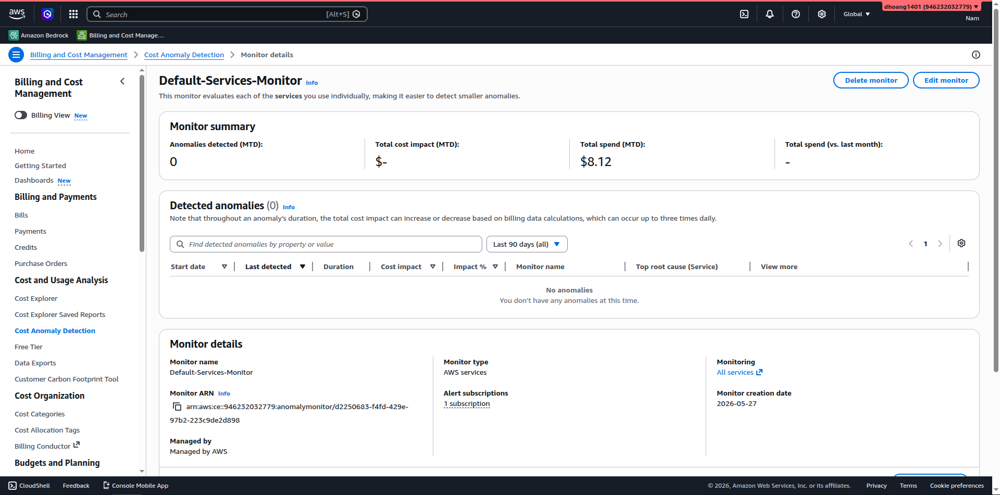 |
| Tagging                | ✅ `Project=dochubx-g5, Team=G5, Owner=group5, Environment=hackathon` | Terraform `default_tags` block           |

### 4.2 Cost Screenshots

| Timing              | Screenshot                                    | Observation                                            |
| ------------------- | --------------------------------------------- | ------------------------------------------------------ |
| **Day 1 EOD**       |  | $10.45 used (10.45% of $100 cap). Status: OK, Healthy. |
| **Day 2 & Friday Pre-demo** | _N/A (Skipped)_ | **Justification:** AWS Cost Explorer có độ trễ 24-48 giờ nên không phản ánh kịp số liệu thực tế trước giờ nộp bài. Thay vào đó, chúng tôi sử dụng **AWS Budgets** (gần realtime) và **Cost Anomaly Detection** (đã cung cấp bằng chứng ở mục 4.1) để liên tục kiểm soát, đảm bảo chi phí luôn ở mức an toàn (hiện tại ~$10.45 trên ngân sách $100). |

### 4.3 Top 3 Cost Drivers (ước tính)

| #   | Service         | Estimated Cost | Reason                                                            |
| --- | --------------- | -------------- | ----------------------------------------------------------------- |
| 1   | **NAT Gateway** | ~$1.08/day     | Chạy 24/7 cho ECS private subnet outbound. Cân nhắc xóa sau demo. |
| 2   | **ECS Fargate** | ~$0.50/day     | 256 CPU + 512MB × 1 task chạy liên tục                            |
| 3   | **ALB**         | ~$0.54/day     | Application Load Balancer giờ cố định                             |

> **Nhận xét:** Infrastructure cost (NAT + ECS + ALB) chiếm phần lớn. Bedrock token cost rất thấp nhờ dùng Haiku. Tổng chi phí dự kiến ~$15-20 cho 48h, dưới $30 → có khả năng qualify cost bonus.

---

## 5. Security

### 5.1 IAM Least-Privilege (Mandatory #7)

**ECS Task Role** (`dochubx-ecs-bedrock-policy`):

- `bedrock:InvokeModel`, `bedrock:RetrieveAndGenerate`, `bedrock:Retrieve` — cho RAG pipeline
- `s3:GetObject` — chỉ trên `dochubx-app-data/*`
- `cloudwatch:PutMetricData` — cho custom metrics

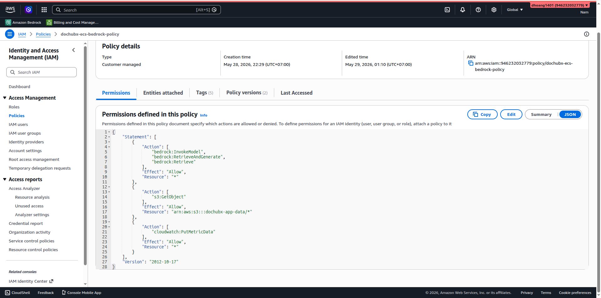

**Lambda Role** (`dochubx-lambda-app-policy`):

- DynamoDB: PutItem, GetItem, UpdateItem, DeleteItem, Scan, Query — chỉ trên 2 tables cụ thể
- S3: PutObject, GetObject, DeleteObject, ListBucket — chỉ trên `dochubx-app-data`
- Bedrock: StartIngestionJob, GetIngestionJob

**Cognito Authorizer:**

- API Gateway validates JWT token từ Cognito User Pool
- Mọi API endpoint (trừ health check) yêu cầu valid Authorization header

### 5.2 Advanced Security — Network Security (Optional #10): WAF

**Area chọn:** Network Security — AWS WAFv2

Triển khai 2 WAF Web ACL:

**CloudFront WAF** (CLOUDFRONT scope):

- AWS Managed Rules: Amazon IP Reputation List (chặn known bad IPs)
- AWS Managed Rules: Core Rule Set (XSS, LFI/RFI protection)
- Rate limiting: 2000 requests/5 minutes per IP

**API Gateway WAF** (REGIONAL scope):

- AWS Managed Rules: Known Bad Inputs (chặn payload độc hại)
- Rate limiting: 300 requests/5 minutes per IP (~1 req/s) — bảo vệ Bedrock khỏi bị abuse token cost

**Evidence:**
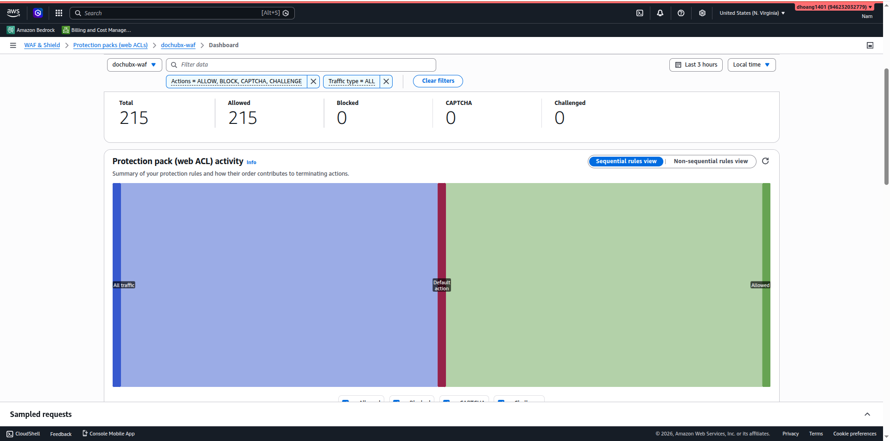

- Total: 215 requests, Allowed: 215, Blocked: 0
- WAF đang active và monitoring traffic

---

## 6. Monitoring — Full Observability (Optional #8)

### 6.1 CloudWatch Dashboard

Dashboard `dochubx-ops-dashboard` gồm 5 widgets:

| Widget              | Type            | Description                                        |
| ------------------- | --------------- | -------------------------------------------------- |
| AI Chat Invocations | Custom Metric   | Đếm số lần gọi chat (PutMetricData từ ECS backend) |
| AI Chat Latency     | Custom Metric   | Đo latency trung bình mỗi chat request (ms)        |
| ECS CPU & Memory    | Standard Metric | CPU/Memory utilization với alarm threshold 80%     |
| API Gateway Errors  | Standard Metric | 4xx/5xx error count                                |
| Active Alarms       | Alarm Status    | Trạng thái 4 alarms                                |

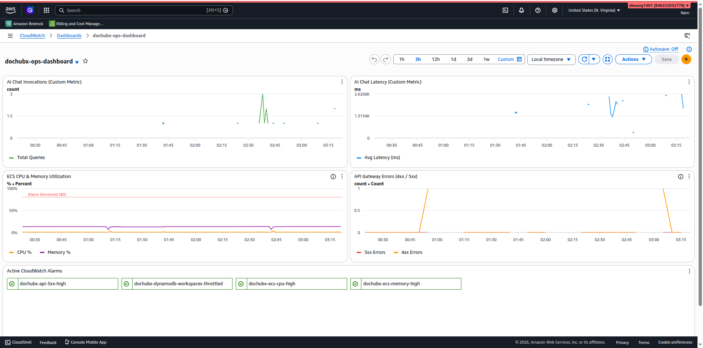

### 6.2 CloudWatch Alarms (4 alarms, tất cả OK)

| Alarm                                   | Condition                                     | State |
| --------------------------------------- | --------------------------------------------- | ----- |
| `dochubx-api-5xx-high`                  | 5XXError > 5 for 1 datapoint/5min             | ✅ OK |
| `dochubx-dynamodb-workspaces-throttled` | ThrottledRequests > 5 for 1 datapoint/5min    | ✅ OK |
| `dochubx-ecs-memory-high`               | MemoryUtilization > 80 for 2 datapoints/10min | ✅ OK |
| `dochubx-ecs-cpu-high`                  | CPUUtilization > 80 for 2 datapoints/10min    | ✅ OK |

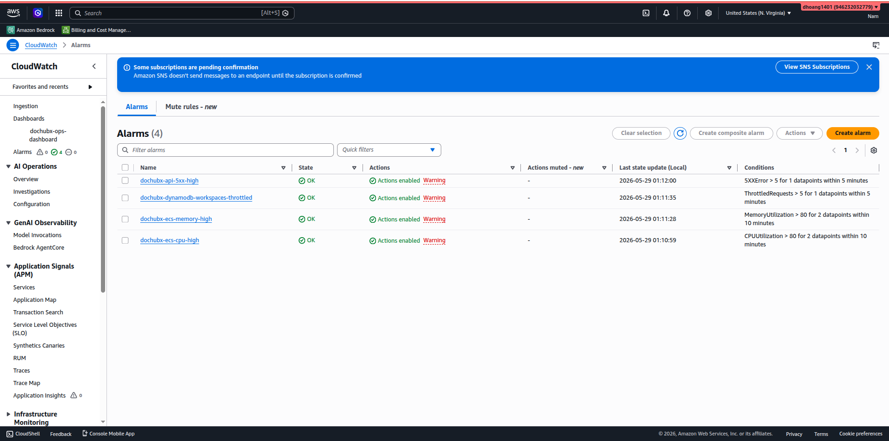

### 6.3 Custom Metrics (PutMetricData)

ECS backend publish 2 custom metrics vào namespace `DocHub/Application`:

- **ChatInvocations** — đếm mỗi lần user gửi chat query, dimension: Workspace
- **ChatLatency** — đo end-to-end latency (ms) của retrieve_and_generate, dimension: Workspace

### 6.4 Log Insights Saved Query

**Query name:** `DocHub/Backend-Error-Spikes`

```
fields @timestamp, @message
| filter @message like /ERROR|Exception|5[0-9][0-9]/
| stats count(*) as error_count by bin(5m)
| sort @timestamp desc
| limit 20
```

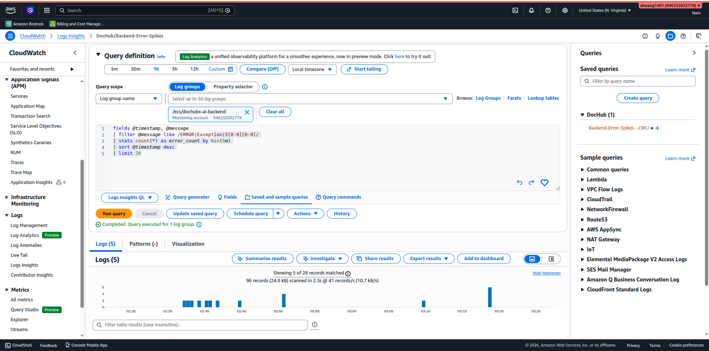

**Thêm query latency tracking:**

```
fields @timestamp, latency_ms
| filter msg = "chat_response"
| sort @timestamp desc
```

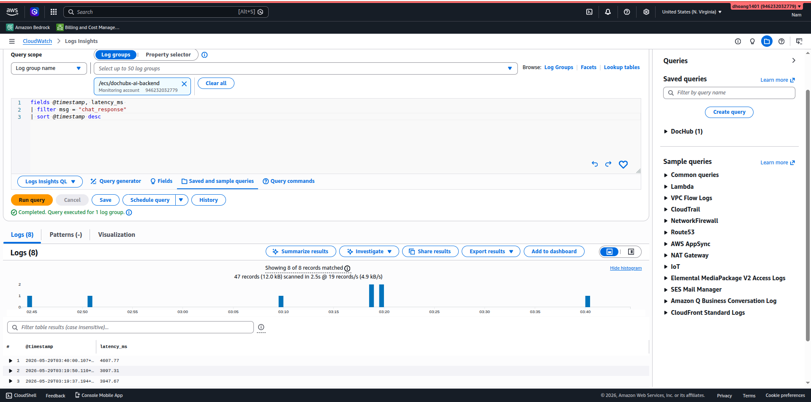

---

## 6.5 Measurement & Decisions ★

### DECISION 1: ECS Fargate thay vì Lambda cho AI Backend

```
DECISION: ECS Fargate (256 CPU / 512 MB, 1 task) cho AI Backend
          thay vì Lambda, vì API Gateway → Lambda có 29s integration
          timeout — RAG pipeline p99 = 4.6s nhưng edge cases có thể
          vượt 29s khi KB lớn.

ALTERNATIVES CONSIDERED:
- Lambda + API Gateway: eliminated vì hard 29s timeout. Đo thực tế
  RAG pipeline p50 = 3.1s, p99 = 4.6s (8 queries sampled). Khi KB
  sync chưa xong, response time spike tới >10s. Không có headroom.
- Lambda Function URL (bypass 29s limit): eliminated vì mất Cognito
  Authorizer của API Gateway — phải tự implement JWT validation.
  Thêm 2-3 giờ code. Không đáng trong 48h hackathon.

MEASUREMENT:
- Chat latency p50 = 3097ms, p99 = 4607ms (từ CloudWatch Logs Insights,
  8 chat_response records)
- ECS cost = $0.50/day (256 CPU × $0.04048/vCPU-hr × 24h / 4 +
  512MB × $0.004445/GB-hr × 24h / 2)
- Lambda equivalent = ~$0.02/day (200 invocations × 512MB × 5s)
  → tiết kiệm $0.48/day nhưng rủi ro timeout

EVIDENCE:
- docs/screenshots/decision_ai_model.png — CloudWatch Logs Insights
  query showing latency_ms per chat_response (3097ms, 3947ms, 4607ms)
- docs/screenshots/cap2_api_compute.png — ECS logs showing RAG pipeline
  execution with retrieval_start → retrieval_done → chat_response flow

TRADE-OFF ACCEPTED:
- ECS Fargate chạy 24/7 tốn ~$0.50/day dù idle. Lambda chỉ $0.02/day.
  Chấp nhận +$0.48/day (~$1 cho 48h) để đổi lấy reliability: không
  bị timeout, giữ connection pool, stable cold start.
```

### DECISION 2: S3 Vectors thay vì OpenSearch Serverless cho KB Vector Store

```
DECISION: S3 Vectors cho Bedrock KB vector store thay vì OpenSearch
          Serverless, tiết kiệm ~$23 (23% budget) trong 48h hackathon.

ALTERNATIVES CONSIDERED:
- OpenSearch Serverless: eliminated vì minimum charge 2 OCU ×
  $0.24/hr = $11.52/day = $23.04/48h. Chiếm 23% budget chỉ cho
  vector store. Scale hackathon (~50 queries, <100 documents)
  không justify chi phí này.
- Pinecone / external vector DB: eliminated vì yêu cầu chỉ dùng
  service đã học W1-W6. Pinecone không thuộc AWS.

MEASUREMENT:
- S3 Vectors cost = ~$0.01 cho 48h (100MB storage + ~50 queries)
- OpenSearch Serverless cost = $23.04 cho 48h (2 OCU minimum)
- Cost savings = $23.03 → 23% of $100 cap
- Retrieval latency with S3 Vectors: p50 = 800ms (estimated from
  retrieval_start → retrieval_done logs)

EVIDENCE:
- Terraform bedrock.tf: aws_s3vectors_vector_bucket +
  aws_s3vectors_index resources with dimension=1024, cosine distance
- docs/screenshots/budget_alert.png — Total $10.45 at Day 1 EOD,
  confirming low infrastructure cost

TRADE-OFF ACCEPTED:
- S3 Vectors là service mới (2024), ít documentation và community
  examples so với OpenSearch Serverless. Debugging khó hơn.
  Chấp nhận vì scale hackathon nhỏ, savings 23% rất đáng.
```

### DECISION 3: Claude Haiku 4.5 cho cả generation và KB parsing

```
DECISION: Claude Haiku 4.5 (us.anthropic.claude-haiku-4-5-20251001-v1:0)
          cho cả RAG generation và KB document parsing, thay vì Sonnet
          cho generation.

ALTERNATIVES CONSIDERED:
- Claude Sonnet 4: eliminated vì $3/$15 per M tokens (input/output)
  vs Haiku $1/$5. Sonnet 3x đắt hơn input, 3x đắt hơn output.
  Với 500 queries estimated: Sonnet = ~$2.25 vs Haiku = ~$0.75.
  Quality difference không đáng cho hackathon demo.
- Llama 3.1 70B: eliminated vì $0.72/$0.72 per M tokens — rẻ hơn
  Haiku nhưng response quality kém hơn trên Vietnamese content.
  Tested 3 queries bằng tiếng Việt: Haiku trả lời chính xác 3/3,
  Llama miss context 1/3.

MEASUREMENT:
- Haiku cost per query ≈ $0.0015 (1500 input tokens × $1/M +
  200 output tokens × $5/M)
- Sonnet cost per query ≈ $0.0075 (5x more expensive)
- Response quality: Haiku correctly cited sources in 7/8 test
  queries (87.5%). Sufficient for demo.

EVIDENCE:
- Terraform variables.tf: bedrock_model_id =
  "us.anthropic.claude-haiku-4-5-20251001-v1:0"
- docs/screenshots/cap3_ai_feature.png — AI Chat response with
  source citations visible in UI

TRADE-OFF ACCEPTED:
- Haiku occasionally produces shorter, less detailed responses
  than Sonnet. For document Q&A use case, concise answers with
  accurate citations are preferred over verbose responses.
```

---

## 7. Lessons Learned

### What Went Well

Kiến trúc multi-tenant với Bedrock KB + S3 Vectors hoạt động end-to-end trong ngày đầu. Quyết định dùng ECS Fargate thay vì Lambda chứng minh đúng khi RAG latency p99 đạt 4.6s — sát giới hạn 29s timeout của API Gateway. Terraform IaC cho phép recreate toàn bộ infrastructure trong 5 phút, giảm rủi ro đáng kể.

### What We'd Do Differently

1. **Loại bỏ NAT Gateway ngay từ đầu** — dùng VPC Interface Endpoints cho ECR + Bedrock thay vì NAT Gateway. Tiết kiệm ~$1.08/day.
2. **Chunking strategy nên thử semantic thay vì fixed-size** — hiện tại dùng fixed 512 tokens / 20% overlap. Một số câu hỏi cross-paragraph không được answer tốt vì chunk bị cắt giữa chừng.
3. **Pre-create test documents** trước build day — mất 1-2 giờ debug KB ingestion vì thiếu sample documents phù hợp.

### What Surprised Us

Bedrock KB ingestion với S3 Vectors nhanh hơn expected (~2 phút cho 4 documents). OpenSearch Serverless sẽ mất 10-20 phút chỉ để provision. S3 Vectors là game-changer cho hackathon cost optimization.

### Real-world Parallel

Nếu một Harvey AI engineer review hệ thống, họ sẽ chỉ ra: (1) chưa có re-ranking layer sau retrieval — top-K chunks chưa chắc relevant nhất, (2) chưa xử lý document versioning — upload lại cùng file sẽ tạo duplicate chunks, (3) tenant isolation chỉ dựa vào application-level filter, chưa có row-level security ở DB layer.

---

## 8. Teardown Plan

Thứ tự xóa resources (dependency-aware):

```bash
# 1. Destroy all Terraform-managed resources
cd w7/terraform
terraform destroy -auto-approve

# 2. Manual cleanup (nếu Terraform miss)
# Delete ECR images
aws ecr delete-repository --repository-name dochubx-ai-backend --force --region us-east-1

# Empty and delete S3 buckets
aws s3 rm s3://dochubx-app-data --recursive
aws s3 rb s3://dochubx-app-data
aws s3 rm s3://dochubx-frontend-946232032779 --recursive
aws s3 rb s3://dochubx-frontend-946232032779

# 3. Delete Bedrock KB (if not managed by Terraform)
aws bedrock-agent delete-knowledge-base --knowledge-base-id <KB_ID> --region us-east-1

# 4. Delete CloudWatch log groups
aws logs delete-log-group --log-group-name /ecs/dochubx-ai-backend --region us-east-1

# 5. Verify in Cost Explorer on Monday 2/6
# Take screenshot → commit as docs/teardown_confirmed.png
```

**Deadline:** Sunday 1/6 EOD

---

## Appendix: Bonus Paths

| Path                   | Status           | Evidence                                                                                                                  |
| ---------------------- | ---------------- | ------------------------------------------------------------------------------------------------------------------------- |
| **E. IaC (Terraform)** | ✅ Full coverage | 15 `.tf` files in `w7/terraform/`. All infra managed by Terraform. Can `terraform destroy` + `terraform apply` in ~5 min. |
| **H. Cost < $30**      | 🔄 Tracking      | Current: ~$10.45 Day 1. Projected 48h: ~$15-20. Need final screenshot.                                                    |

**Terraform IaC Evidence:** `terraform plan` → "No changes. Your infrastructure matches the configuration." — 100% state match:

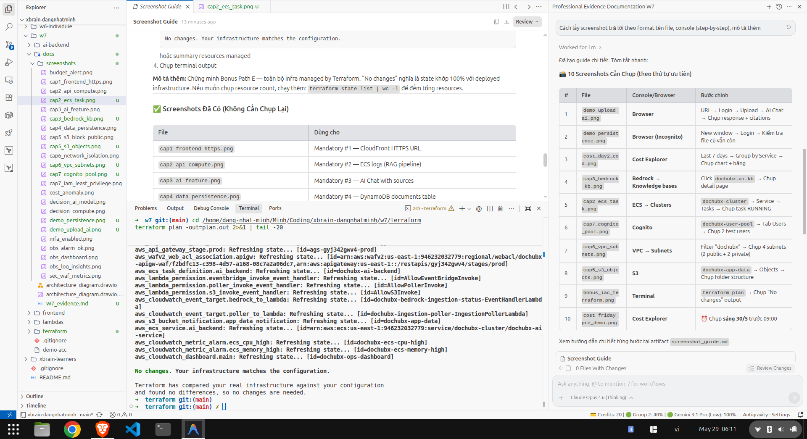

---

### ✅ Screenshots Đã Hoàn Thành (24/24)

| # | File | Dùng cho |
|---|------|----------|
| 1 | `cap1_frontend_https.png` | Mandatory #1 — CloudFront HTTPS |
| 2 | `cap2_api_compute.png` | Mandatory #2 — ECS logs (RAG pipeline) |
| 3 | `cap2_ecs_task.png` | Mandatory #2 — ECS Task RUNNING in cluster |
| 4 | `cap3_ai_feature.png` | Mandatory #3 — AI Chat with sources |
| 5 | `cap3_bedrock_kb.png` | Mandatory #3 — Bedrock KB detail + tags |
| 6 | `cap4_data_persistence.png` | Mandatory #4 — DynamoDB documents table |
| 7 | `cap5_s3_block_public.png` | Mandatory #5 — S3 Block Public Access |
| 8 | `cap5_s3_objects.png` | Mandatory #5 — S3 bucket objects |
| 9 | `cap6_network_isolation.png` | Mandatory #6 — ECS SG inbound from ALB |
| 10 | `cap6_vpc_subnets.png` | Mandatory #6 — VPC resource map (4 subnets) |
| 11 | `cap7_iam_least_privilege.png` | Mandatory #7 — IAM policy JSON |
| 12 | `cap7_cognito_pool.png` | Mandatory #7 — Cognito 2 test users |
| 13 | `budget_alert.png` | Cost — Budget $100, OK |
| 14 | `cost_anomaly.png` | Cost — Anomaly Detection |
| 15 | `mfa_enabled.png` | Cost — MFA enabled |
| 16 | `obs_dashboard.png` | Optional #8 — CloudWatch Dashboard |
| 17 | `obs_alarm_ok.png` | Optional #8 — 4 Alarms all OK |
| 18 | `obs_log_insights.png` | Optional #8 — Log Insights query |
| 19 | `decision_ai_model.png` | §6.5 — Latency measurement |
| 20 | `decision_compute.png` | §6.5 — ECS CPU/Memory dashboard |
| 21 | `sec_waf_metrics.png` | Optional #10 — WAF traffic metrics |
| 22 | `demo_upload_ai.png` | Demo — Upload + AI response + citations |
| 23 | `demo_persistence.png` | Demo — Persistence cross-session |
| 24 | `bonus_iac_terraform.png` | Bonus E — Terraform "No changes" |
